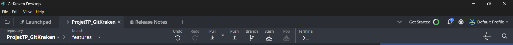
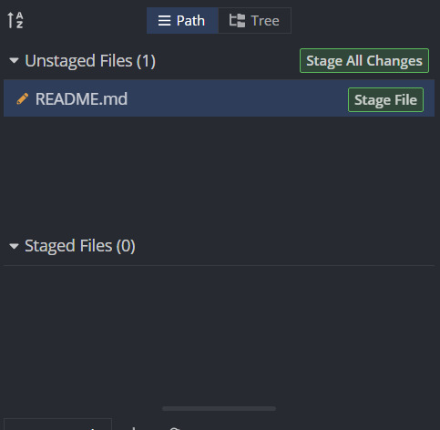
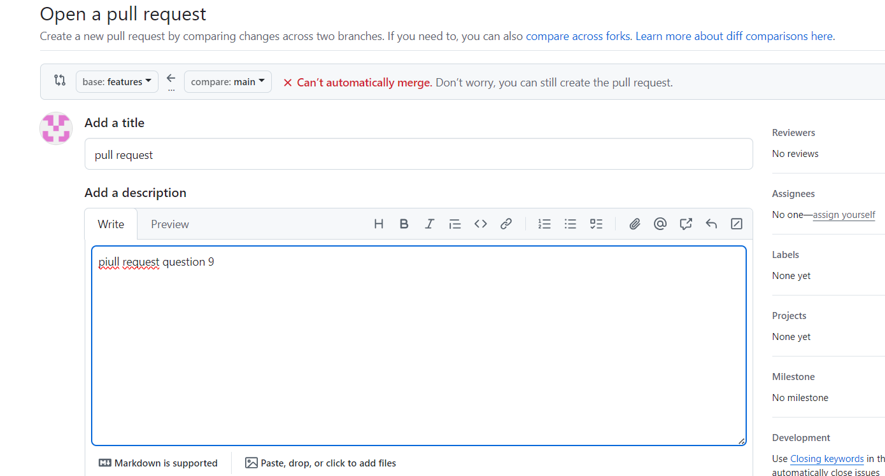
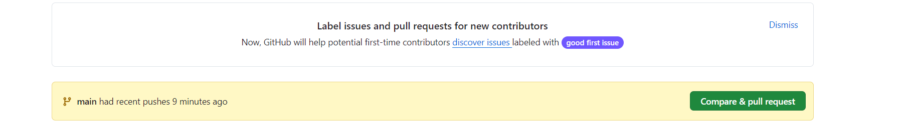
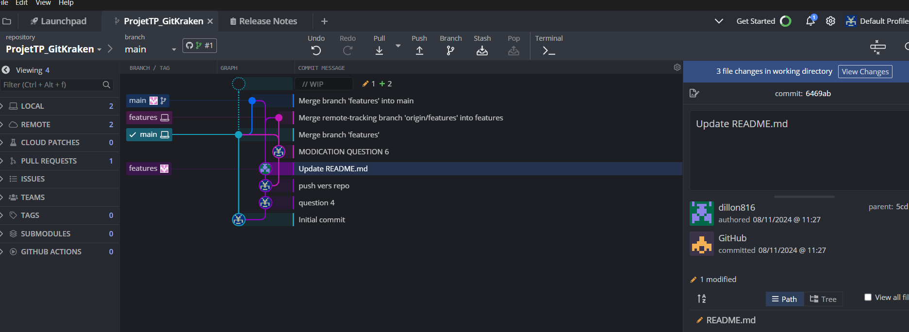
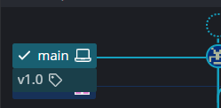

## Tp Kraken

## Question 1 :
## Open Repo : Ouvre un dépôt Git existant sur votre machine locale.

## Clone Repo : Clone un dépôt depuis un serveur distant et crée une copie locale.

## Create Repo : Initialise un nouveau dépôt Git sur votre machine locale.

## Group Repos : Crée un espace de travail avec plusieurs dépôts pour faciliter la gestion et l’organisation.

## Question 2

## 
## Premiere etapes :choisir un nom au repository
## etape 2: choisir l emplacemenr du dossier
## etape 3: on peut voir  l'emplacement entier  du fichier
##  etape 4 :S'assurer de la laiseer la branch par defaut :main
## Etape 5 (optionel): Cette option permet de selectionner un modele de fichier .gitignore .
## Etape 6 (optionel): choix une license pour le projet
## Etape 7  Initialize with LFS : Cette case permet d’initialiser le dépôt avec Git Large File Storage (LFS), qui est une extension de Git pour gérer les fichiers volumineux (comme les images ou vidéos) sans encombrer le depot principal. 
##  Etape final :create repository

## Question 3

## Isoler les modifaction  pour ne pas affecter le main,  facilite le travail en equipe travailler sur plusieurs ameliorations en meme temp sans genre la personne. Permet de faire des test.
## modif question4
## Question 4

## Quand ont  modifies des fichiers, ils apparaissent dans Unstaged files. Pour les inclure dans  le commit, ils  faut les déplacer dans Staged files.
## Pour ça, tu cliques stage files à côté de chaque fichier modifié. Une fois dans Staged, ils sont prêts à être commités.
## 

## Question 5

## 
## Selectionnez le commits  a push ,cliquer sur push  et selctionner le repo voulu.

## Question 6
## Un conflit Git se produit lorsqu'il y a des divergences dans le contenu de deux branches que Git ne peut pas résoudre automatiquement lors d'une fusion (merge) ou d'une rebasage (rebase). Cela arrive généralement lorsque deux personnes ou plus ont modifié la même ligne ou la même section d’un fichier de manière différente dans leurs propres branches.
## 

## Question 7

## CEST UNE MODIFICATION
## 
## On voit qu il y a une erreur en faisant merge sur la branche voulue .
## Puis en cliquant sur le read me on peut choisir la modification qu'on veut garder.
## 

## Question 8
## Un commit de merge est créé automatiquement par Git quand il fusionne deux branches. Il enregistre la fusion des modifications des deux branches et montre qu'une fusion a bien eu lieu. Ce commit permet de garder une trace de cette action dans l'historique du projet.

## Question 9

## Une Pull Request (PR) dans Git est utilisée pour proposer des modifications d'une branche vers une autre, généralement vers la branche principale (comme main ou master). Elle permet de soumettre, examiner et discuter les changements avant de les intégrer dans la branche cible.
## Question 10
## 
## Cliquer sur coprARe et pull request
## 
## Un merge direct fusionne une branche dans une autre sans revue, tandis qu’une Pull Request (PR) est une demande de fusion qui permet aux autres de revoir et valider les modifications avant qu’elles soient intégrées.La PR est plus courante dans les projets collaboratifs car elle assure une meilleure qualité du code grâce à la revue, la discussion et l'intégration des retours. ## Elle permet aussi d’automatiser des tests pour vérifier que les changements n’introduisent pas de bugs.

## Question 11
## 
## L'interface de GitKraken offre une vue graphique qui facilite la gestion des branches et des commits. Elle affiche un graph où les branches et les commits sont clairement représentés, permettant de voir rapidement l'historique des modifications et les relations entre les branches.

## Question 12 
## 
## Les tags dans un projet Git sont utilisés pour marquer des points spécifiques dans l'historique du projet, souvent pour indiquer des versions ou des étapes importantes (comme une release, un milestone, ou une version stable).

